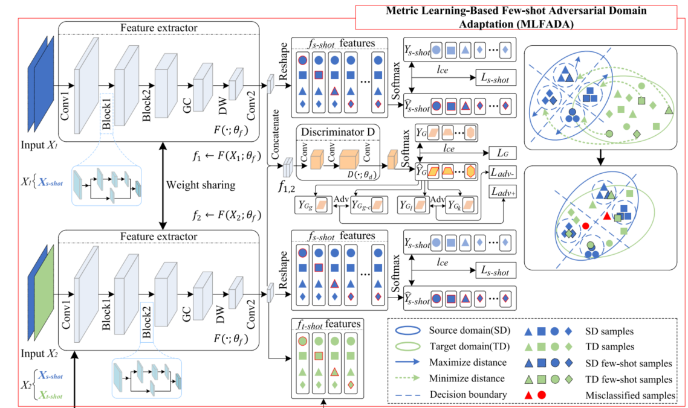

 
# 📝 Publications 
## 🎙 Fault diagnosis
- [1]	Chen Q, Li Q, Wu S, et al. [Fault diagnosis for ball screws in industrial robots under variable and inaccessible working conditions with non-vibration signals](https://www.sciencedirect.com/science/article/abs/pii/S1474034624002659) [J]. Advanced Engineering Informatics, 2024, 62: 102617. (JCR: Q1, IF: 8.1)
# 
```html
@article{CHEN2024102617,
title = {Fault diagnosis for ball screws in industrial robots under variable and inaccessible working conditions with non-vibration signals},
journal = {Advanced Engineering Informatics},
volume = {62},
pages = {102617},
year = {2024},
issn = {1474-0346},
doi = {https://doi.org/10.1016/j.aei.2024.102617},
url = {https://www.sciencedirect.com/science/article/pii/S1474034624002659},
author = {Qitong Chen and Qi Li and Sijia Wu and Liang Chen and Changqing Shen}
}
```
- [2]	 Chen Q, Chen L, Li Q, et al. [Metric Learning-Based Few-Shot Adversarial Domain Adaptation: A Cross-Machine Diagnosis Method for Ball Screws of Industrial Robots](https://ieeexplore.ieee.org/abstract/document/10535297)[J]. IEEE Transactions on Instrumentation and Measurement, 2024. (JCR: Q1, IF: 5.6)
#  
```html
@ARTICLE{10535297,
  author={Chen, Qitong and Chen, Liang and Li, Qi and Shi, Juanjuan and Wang, Dong and Shen, Changqing},
  journal={IEEE Transactions on Instrumentation and Measurement}, 
  title={Metric Learning-Based Few-Shot Adversarial Domain Adaptation: A Cross-Machine Diagnosis Method for Ball Screws of Industrial Robots}, 
  year={2024},
  volume={73},
  number={},
  pages={1-10},
  keywords={Mechanical products;Feature extraction;Fault diagnosis;Robots;Vibrations;Measurement;Few shot learning;Adversarial domain adaptation (ADA);ball screw;cross-machine diagnosis;few-shot;lightweight},
  doi={10.1109/TIM.2024.3403183}}
```
- [3]	Chen Q, Chen L, Li Q, et al. [A lightweight and robust model for engineering cross-domain fault diagnosis via feature fusion-based unsupervised adversarial learning](https://www.sciencedirect.com/science/article/abs/pii/S0263224122013355) [J]. Measurement, 2022, 205: 112139. (JCR: Q1, IF: 5.2)
# 
```html
@article{CHEN2022112139,
title = {A lightweight and robust model for engineering cross-domain fault diagnosis via feature fusion-based unsupervised adversarial learning},
journal = {Measurement},
volume = {205},
pages = {112139},
year = {2022},
issn = {0263-2241},
doi = {https://doi.org/10.1016/j.measurement.2022.112139},
url = {https://www.sciencedirect.com/science/article/pii/S0263224122013355},
author = {Qitong Chen and Liang Chen and Qi Li and Juanjuan Shi and Zhongkui Zhu and Changqing Shen}
}
```
- [4]	 Chen Q, Zhuang H, Zhang Y, et al. [Few-shot Metric Adversarial Adaptation for Cross-machine Fault Diagnosis](https://ieeexplore.ieee.org/abstract/document/10886709)[C]//63rd IEEE Conference on Decision and Control (CDC). 2024. (Automation Top Conference Papers)
# 
```html
@INPROCEEDINGS{10886709,
  author={Chen, Qitong and Zhuang, Hong and Zhang, Yueyuan and Chen, Liang and Li, Qi},
  booktitle={2024 IEEE 63rd Conference on Decision and Control (CDC)}, 
  title={Few-shot Metric Adversarial Adaptation for Cross-machine Fault Diagnosis}, 
  year={2024},
  volume={},
  number={},
  pages={1319-1325},
  keywords={Measurement;Fault diagnosis;Learning systems;Feature extraction;Industrial robots;Adversarial machine learning;Robustness;Data models;Mechanical products;Machinery},
  doi={10.1109/CDC56724.2024.10886709}}
```
- [5]	Chen X, Yin H, Chen Q, et al. [Multi-source subdomain negative transfer suppression and multiple pseudo-labels guidance alignment: A method for fault diagnosis under cross-working conditions](https://www.sciencedirect.com/science/article/abs/pii/S0019057824003847) [J]. ISA transactions, 2024. (JCR: Q1, IF: 6.3)
# 
```html
@article{CHEN2024389,
title = {Multi-source subdomain negative transfer suppression and multiple pseudo-labels guidance alignment: A method for fault diagnosis under cross-working conditions},
journal = {ISA Transactions},
volume = {154},
pages = {389-406},
year = {2024},
issn = {0019-0578},
doi = {https://doi.org/10.1016/j.isatra.2024.08.012},
url = {https://www.sciencedirect.com/science/article/pii/S0019057824003847}}
```
- [6]	Li X, Chen Q, Chen L, et al. [Joint Domain Adaptation Based Lightweight Approach for Cross-domain Diagnosis Compatible with Different Devices and Multimodal Sensing](https://ieeexplore.ieee.org/abstract/document/10608057) [J]. IEEE Sensors Journal, 2024. (JCR: Q1, , IF: 4.2)
# 
```html
@ARTICLE{10608057,
  author={Li, Xuan and Chen, Qitong and Chen, Liang and Shen, Changqing},
  journal={IEEE Sensors Journal}, 
  title={Joint Domain Adaptation-Based Lightweight Approach for Cross-Domain Diagnosis Compatible With Different Devices and Multimodal Sensing}, 
  year={2024},
  volume={24},
  number={17},
  pages={28373-28382},
  keywords={Adaptation models;Feature extraction;Convolutional neural networks;Vibrations;Fault diagnosis;Computational modeling;Mathematical models;Industrial application;joint domain adaptation;lightweight model;multimodal sensing;universal fault diagnosis},
  doi={10.1109/JSEN.2024.3430100}}
```
- [7]	Yin H, Chen Q, Chen L, et al. [Cross Attention Transformer-Based Domain Adaptation: A Novel Method for Fault Diagnosis of Rotating Machinery with High Generalizability and Alignment Capability](https://ieeexplore.ieee.org/abstract/document/10723230) [J]. IEEE Sensors Journal, 2024. (JCR: Q1, IF: 4.2)
# 
```html
@ARTICLE{10723230,
  author={Yin, Hua and Chen, Qitong and Chen, Liang and Shen, Changqing},
  journal={IEEE Sensors Journal}, 
  title={Cross-Attention Transformer-Based Domain Adaptation: A Novel Method for Fault Diagnosis of Rotating Machinery With High Generalizability and Alignment Capability}, 
  year={2024},
  volume={24},
  number={23},
  pages={40049-40058},
  keywords={Transformers;Fault diagnosis;Adaptation models;Mathematical models;Machinery;Attention mechanisms;Sensors;Data models;Long short term memory;Computer architecture;Cross-attention;fault diagnosis;rotating machinery;source–target domain (S–T Domain);Transformer-based domain adaptation},
  doi={10.1109/JSEN.2024.3479706}}
```
- [8]	Wang Q, Chen Q, Chen L, et al. [Dual-weight Attention-based Multi-source Multi-stage Alignment Domain Adaptation for Industrial Fault Diagnosis](https://iopscience.iop.org/article/10.1088/1361-6501/ad5038/meta) [J]. Measurement Science and Technology, 2024. (JCR: Q2, IF: 2.6)
# 
```html
@article{Wang_2024,
doi = {10.1088/1361-6501/ad5038},
url = {https://dx.doi.org/10.1088/1361-6501/ad5038},
year = {2024},
month = {jun},
publisher = {IOP Publishing},
volume = {35},
number = {9},
pages = {096105},
author = {Wang, Qi and Chen, Qitong and Chen, Liang and Shen, Changqing},
title = {Dual-weight attention-based multi-source multi-stage alignment domain adaptation for industrial fault diagnosis},
journal = {Measurement Science and Technology}}
```
- 


