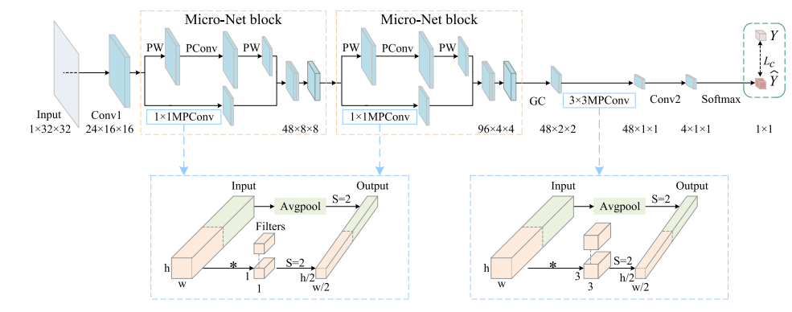
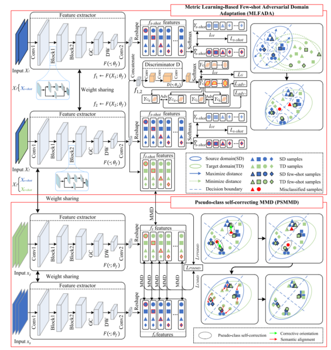
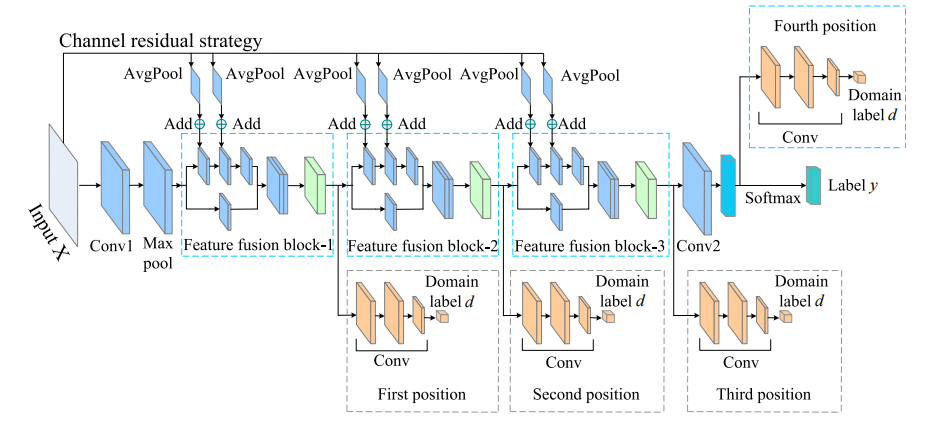
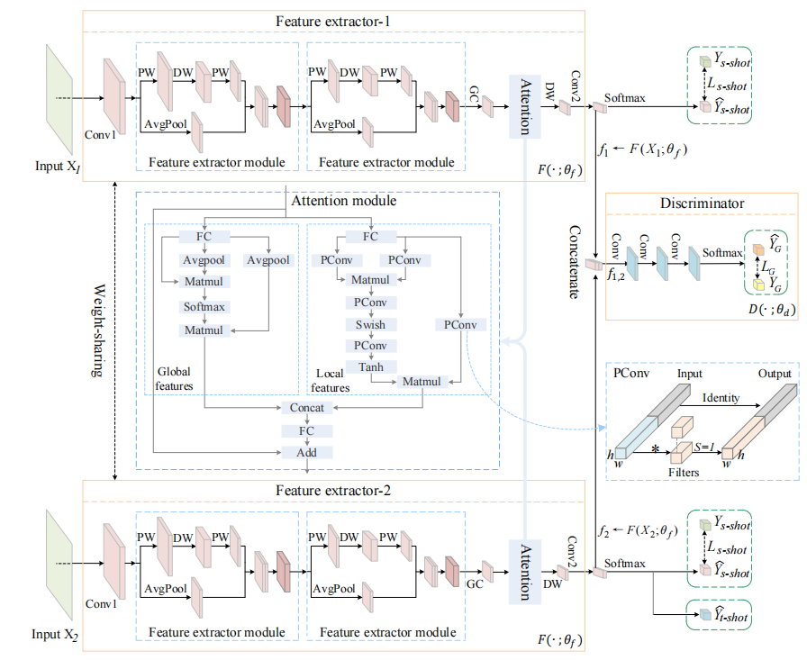
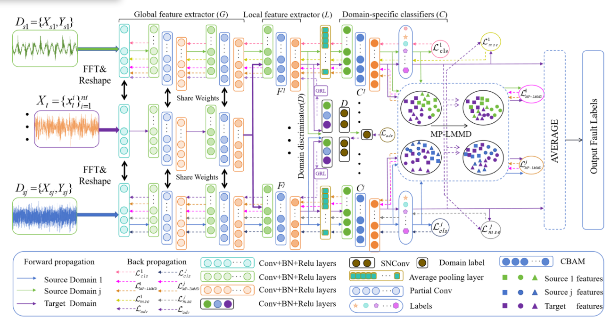
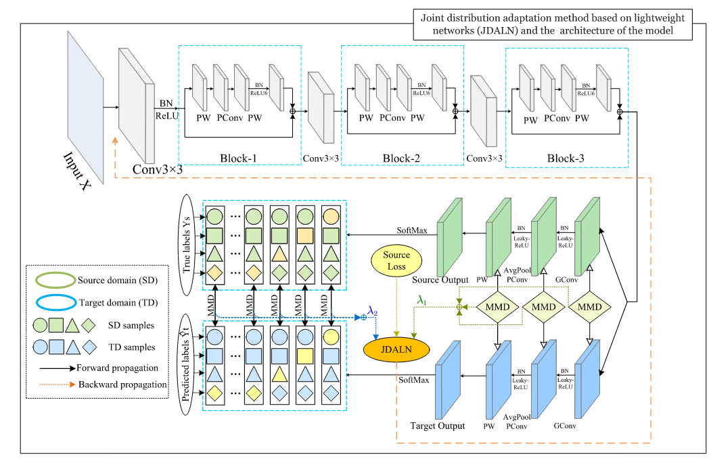
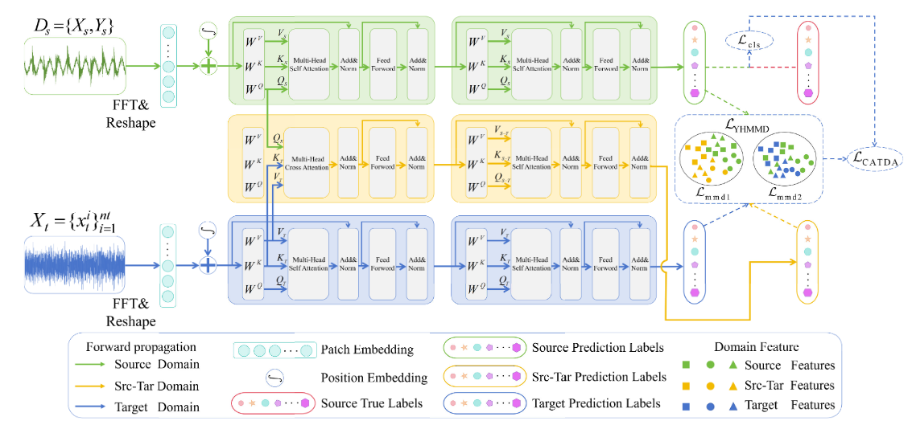
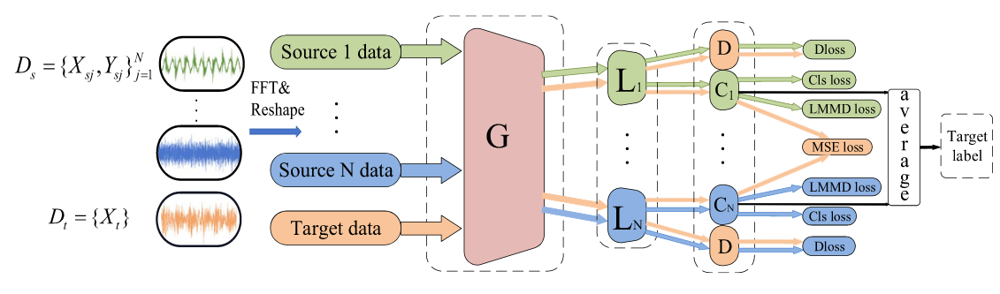

 
# 📝 Publications 
## 🎙 Fault diagnosis
- [1]	Chen Q, Li Q, Wu S, et al. [Fault diagnosis for ball screws in industrial robots under variable and inaccessible working conditions with non-vibration signals](https://www.sciencedirect.com/science/article/abs/pii/S1474034624002659) [J]. Advanced Engineering Informatics, 2024, 62: 102617. (JCR: Q1, IF: 8.1)
# 
- [2]	 Chen Q, Chen L, Li Q, et al. [Metric Learning-Based Few-Shot Adversarial Domain Adaptation: A Cross-Machine Diagnosis Method for Ball Screws of Industrial Robots](https://ieeexplore.ieee.org/abstract/document/10535297)[J]. IEEE Transactions on Instrumentation and Measurement, 2024. (JCR: Q1, IF: 5.6)
# 
- [3]	Chen Q, Chen L, Li Q, et al. [A lightweight and robust model for engineering cross-domain fault diagnosis via feature fusion-based unsupervised adversarial learning](https://www.sciencedirect.com/science/article/abs/pii/S0263224122013355) [J]. Measurement, 2022, 205: 112139. (JCR: Q1, IF: 5.2)
# 
- [4]	 Chen Q, Zhuang H, Zhang Y, et al. [Few-shot Metric Adversarial Adaptation for Cross-machine Fault Diagnosis](https://ieeexplore.ieee.org/abstract/document/10886709)[C]//63rd IEEE Conference on Decision and Control (CDC). 2024. (Automation Top Conference Papers)
# 
- [5]	Chen X, Yin H, Chen Q, et al. [Multi-source subdomain negative transfer suppression and multiple pseudo-labels guidance alignment: A method for fault diagnosis under cross-working conditions](https://www.sciencedirect.com/science/article/abs/pii/S0019057824003847) [J]. ISA transactions, 2024. (JCR: Q1, IF: 6.3)
# 
- [6]	Li X, Chen Q, Chen L, et al. [Joint Domain Adaptation Based Lightweight Approach for Cross-domain Diagnosis Compatible with Different Devices and Multimodal Sensing](https://ieeexplore.ieee.org/abstract/document/10608057) [J]. IEEE Sensors Journal, 2024. (JCR: Q1, , IF: 4.2)
# 
- [7]	Yin H, Chen Q, Chen L, et al. [Cross Attention Transformer-Based Domain Adaptation: A Novel Method for Fault Diagnosis of Rotating Machinery with High Generalizability and Alignment Capability](https://ieeexplore.ieee.org/abstract/document/10723230) [J]. IEEE Sensors Journal, 2024. (JCR: Q1, IF: 4.2)
# 
- [8]	Wang Q, Chen Q, Chen L, et al. [Dual-weight Attention-based Multi-source Multi-stage Alignment Domain Adaptation for Industrial Fault Diagnosis](https://iopscience.iop.org/article/10.1088/1361-6501/ad5038/meta) [J]. Measurement Science and Technology, 2024. (JCR: Q2, IF: 2.6)
# 
- 

